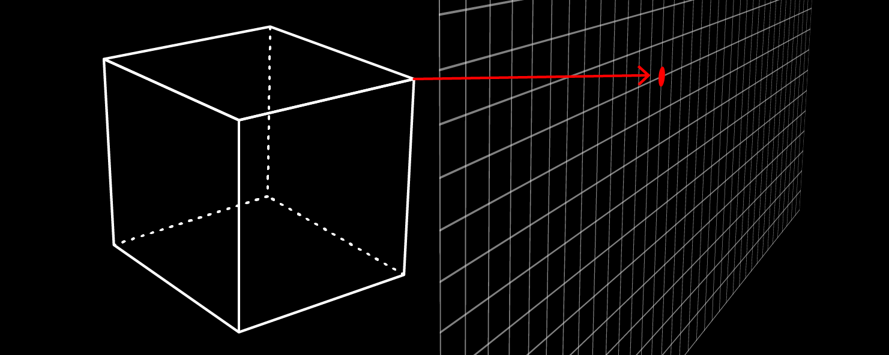

# p5js-screenPosition



This function provides a solution to the missing screenX and screenY functions in p5.js. See https://github.com/processing/p5.js/issues/1553 for the discussion. 

**This is work in progress.** 

As far as I could find out there should be anything implemented to make it work perfectly in any mode (2D, WEBGL, angleMode DEGREES or RADIANS, normal or instance mode). If you'll find a case that isn't working correctly, please file an issue.

## Usage

For a quick look on what it's doing see https://editor.p5js.org/bohnacker/sketches/nUk3bVW7b. 

### 1. Download
Download the latest release of `addScreenPositionFunction.js`.

### 2. Use it in your project
Link to it in your HTML file. It's only working in combination with p5.js.

``` html
<script src="p5.js"></script>
<script src="addScreenPositionFunction.js"></script>
```

### 3. Initializing
Call the function `addScreenPositionFunction()` after creating the canvas.

``` javascript
function setup() {
  createCanvas(400, 400);
  addScreenPositionFunction();
}
```

If your using p5.js in instance mode you have to pass the instance:

``` javascript
p.setup = function() {
  p.createCanvas(400, 400);
  addScreenPositionFunction( p );
};
```

Quite similar if you want to use the function with offscreen graphics:

``` javascript
graphics = createGraphics(400, 400);
addScreenPositionFunction( graphics );
```


### 4. Getting the screen position
Now you can use `screenPosition(x, y, [z])` to get the position of a coordinate on screen. It returns a p5.Vector.
``` javascript
var p = screenPosition(-100, 50, 0);
```

Or giving a p5.Vector:
``` javascript
var v = createVector(-100, 50, 0)
var p = screenPosition( v );
```

Or giving an array with x, y, z coordinates:
``` javascript
var v = [-100, 50, 0];
var p = screenPosition( v );
```

## Acknowledgements
Thanks to Thibault Coppex (@tcoppex) for the 3d-modelview-projection-math he supplied in the issue discussion thread (https://github.com/processing/p5.js/issues/1553). I had to adjust it a bit maybe because p5js changed the way webgl is handled since 2016.
